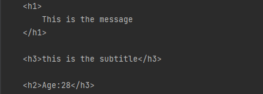

### Smarty template engine support for `php->go` applications

### Install
`go get github.com/borankux/gosmarty/smarty`

### Usage:

providing that template look like this:
```html
    <h1>
        {{$message}}
    </h1>
    <h3>{{$subtitle}}</h3>
    <h2>Age:{{$age}}</h3>
```
assigning and rendering:

```go
	s := smarty.Smarty{}
	s.Assign("message", "This is the message")
	s.Assign("subtitle", "this is the subtitle")
	s.Assign("age", 28)
	rendered := s.Render("main")
	fmt.Println(rendered)
```
output:
```html

```

### Todo
- [x] Basic Mustache variable assign and replace
- [x] File import support
- [ ] Comments removal  
- [ ] Statement support
- [ ] Complex data type  
- [ ] Configuration support
- [ ] Error handling
- [ ] Plugin support
- [ ] Cache support
- [ ] Testing
- [ ] Document
- [ ] Chain style
- [ ] CI: github actions

